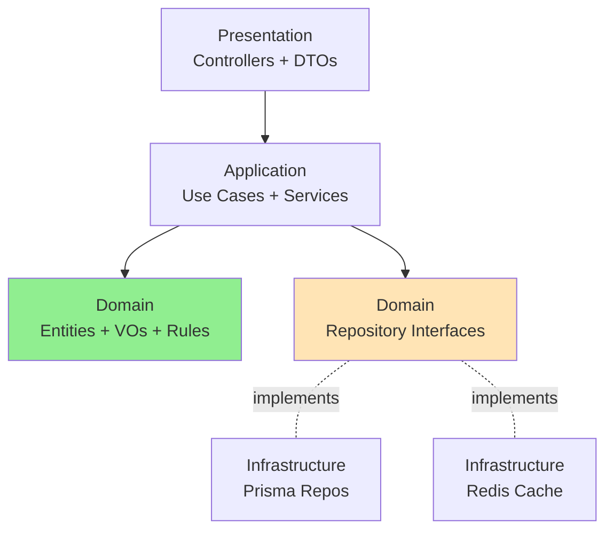

# Architecture & Design Decisions

> Decisões arquiteturais, trade-offs e melhorias futuras.

---

## Arquitetura

### Clean Architecture + Hexagonal (Ports & Adapters)



```

Ou versão ainda mais simples (ASCII art):
```

**Separação em 4 camadas:**

- **Domain:** Regras de negócio puras (sem frameworks, sem I/O)
- **Application:** Orquestração via Use Cases
- **Infrastructure:** Implementações concretas (Prisma, Redis)
- **Presentation:** Interface HTTP (Controllers, Guards, DTOs)

**Core principles:**

- ✅ Dependency Inversion: Core não depende de frameworks
- ✅ Testability: Domain testável sem infraestrutura
- ✅ Framework Independence: Pode trocar NestJS sem reescrever lógica

---

## 🎯 Decisões Arquiteturais

### 1. Fastify vs Express

**Escolha:** Fastify  
**Motivo:** 2x mais rápido, melhor type-safety  
**Trade-off:** Ecossistema menor, mas NestJS abstrai diferenças

---

### 2. Prisma vs TypeORM

**Escolha:** Prisma  
**Motivo:** Type-safety 100%, melhor DX, migrations confiáveis  
**Trade-off:** Sem Active Record, mas força Repository Pattern (benefício)

---

### 3. Refresh Token: UUID vs JWT

**Escolha:** UUID armazenado no Redis  
**Motivo:** Controle total, logout instantâneo, sem blacklist  
**Trade-off:** Depende do Redis, mas refresh é operação infrequente

---

### 4. Reservar Estoque: Criação vs Conclusão

**Escolha:** Reservar na **criação** do pedido (PENDING)  
**Motivo:** Previne overselling, garante disponibilidade

**Cenário sem reserva (problema):**

```
Estoque: 5 unidades
User1 cria pedido: 5 unidades → OK (não debita)
User2 cria pedido: 3 unidades → OK (não debita)
Total vendido: 8 unidades (apenas 5 existem) ❌
```

**Solução implementada:**

```typescript
// Transação atômica com condição WHERE
const updated = await tx.product.updateMany({
  where: { id: productId, stock: { gte: quantity } }, // ← Atomic check
  data: { stock: { decrement: quantity } },
});

if (updated.count === 0) throw InsufficientStockException;
```

**Trade-off:** Estoque fica "preso" em pedidos PENDING  
**Solução:** Expiração automática em 30min

---

### 5. Expiração: Scheduler vs Redis Keyspace Notifications

**Escolha:** NestJS Scheduler (cron)  
**Motivo:** Controle explícito, testável, logs claros  
**Trade-off:** Pode perder pedidos se app crashar (aceitável para MVP)

**Como funciona:**

1. Pedido PENDING → Redis com TTL 30min
2. Scheduler roda a cada 10s
3. Busca pedidos PENDING no DB
4. Se não está no Redis → expirou → cancela + devolve estoque

---

### 6. Mappers na Infrastructure

**Escolha:** Mappers conhecem Prisma, ficam em Infrastructure  
**Motivo:** Application não conhece detalhes do ORM (SRP, DIP)  
**Alternativa evitada:** Mappers em Application (acopla com Prisma)

---

### 7. User + Auth: Módulos Separados

**Escolha:** User (CRUD) separado de Auth (autenticação)  
**Motivo:** Single Responsibility Principle  
**Alternativa evitada:** Tudo em um módulo (viola SRP)

---

### 8. Exception Filter Centralizado

**Escolha:** Um único HttpExceptionFilter para todos os erros  
**Motivo:** Padronização, observabilidade, manutenção

**Formato padronizado:**

```json
{
  "statusCode": 404,
  "timestamp": "2026-04-03T...",
  "path": "/orders/123",
  "traceId": "uuid",
  "error": {
    "message": "Order not found",
    "error": "OrderNotFoundException"
  }
}
```

---

## 🎨 Patterns Aplicados

### Repository Pattern

Interface no Domain, implementação na Infrastructure.  
Benefício: Desacopla lógica de negócio do ORM.

### Value Objects

`Money`, `Email`, `OrderStatus` - Encapsulam validação e comportamento.  
Benefício: Imutabilidade, type-safety, validação centralizada.

### Mapper Pattern

Traduz Prisma Models ↔ Domain Entities.  
Benefício: Domain isolado de detalhes do Prisma.

### Dependency Inversion

Use Cases dependem de interfaces, não implementações.  
Benefício: Testável com mocks, fácil trocar implementações.

---

## 🔴 Princípios SOLID

**Single Responsibility:** Use Cases, Repositories, Mappers - cada um com responsabilidade única  
**Open/Closed:** Novos repositórios sem modificar Use Cases  
**Liskov Substitution:** Qualquer implementação de `IRepository` funciona  
**Interface Segregation:** Repositórios específicos por domínio  
**Dependency Inversion:** Use Cases → Interfaces ← Implementations

---

## ⚠️ Problemas Conhecidos

### 1. Access Token válido após Logout

**Problema:** JWT continua válido por até 15min após logout  
**Causa:** Tokens stateless (sem consulta Redis)  
**Trade-off aceito:** Performance vs logout instantâneo  
**Mitigação:** Refresh token invalidado imediatamente  
**Solução futura:** Blacklist de tokens (custo: latência em toda request)

---

### 2. Scheduler pode perder pedidos

**Problema:** Se app crashar durante expiração, pedidos ficam PENDING  
**Causa:** Scheduler roda no processo da aplicação  
**Trade-off aceito:** Simplicidade vs alta disponibilidade  
**Solução futura:** Timestamp na tabela + múltiplas instâncias com distributed lock

---

### 3. Rate Limit por IP é contornável

**Problema:** Usuário muda IP (proxy/VPN) e bypassa limite  
**Trade-off aceito:** Simplicidade vs proteção total  
**Mitigação:** Protege contra abuso acidental e scripts simples  
**Solução futura:** Rate limit por userId + CAPTCHA após X falhas

---

### 4. Idempotência não valida body

**Problema:** Mesma key com body diferente retorna recurso errado  
**Trade-off aceito:** Performance vs validação completa  
**Responsabilidade:** Cliente deve gerar key nova por request  
**Solução futura:** Hash do body junto com key

---

### 5. Sem RBAC

**Problema:** Todos usuários têm mesmo nível de acesso  
**Trade-off aceito:** MVP não requer admin  
**Solução futura:** Roles (ADMIN, USER) + RolesGuard

---

### 6. Logs apenas em erros

**Problema:** Caminho feliz não gera logs de auditoria  
**Trade-off aceito:** Performance vs observabilidade  
**Solução futura:** Structured logging em pontos críticos (criar pedido, login)

---

## 🚀 Melhorias Futuras

### Testes

- Unit tests (Use Cases com mocks)
- E2E tests (Controllers com test DB)
- Target: >80% coverage

### Observabilidade

- Prometheus metrics (orders created, completion time)
- OpenTelemetry tracing
- APM (Datadog/New Relic)

### Arquitetura

- Event-Driven (Domain Events + Message Queue)
- CQRS (separar leitura e escrita)
- GraphQL como alternativa ao REST

### Performance

- Cache de queries (Redis)
- Database indexes
- Connection pooling (PgBouncer)
- Materialized views

### Features

- Webhook system para notificações
- Admin dashboard
- API versioning
- Múltiplos métodos de pagamento
- Sistema de cupons/descontos

---

## 📊 Stack Técnica

**Backend:** Node.js 22, TypeScript, NestJS + Fastify  
**Database:** PostgreSQL 16 + Prisma 7  
**Cache:** Redis 7  
**Auth:** JWT + bcrypt  
**Infra:** Docker Compose  
**Logging:** Winston  
**Docs:** Swagger/OpenAPI

---

## 📚 Referências

- [Clean Architecture - Uncle Bob](https://blog.cleancoder.com/uncle-bob/2012/08/13/the-clean-architecture.html)
- [Hexagonal Architecture](https://alistair.cockburn.us/hexagonal-architecture/)
- [DDD - Eric Evans](https://www.domainlanguage.com/ddd/)
- [Repository Pattern](https://martinfowler.com/eaaCatalog/repository.html)
- [SOLID Principles](https://en.wikipedia.org/wiki/SOLID)

---

**📖 Para setup e uso, veja [README.md](./README.md)**
